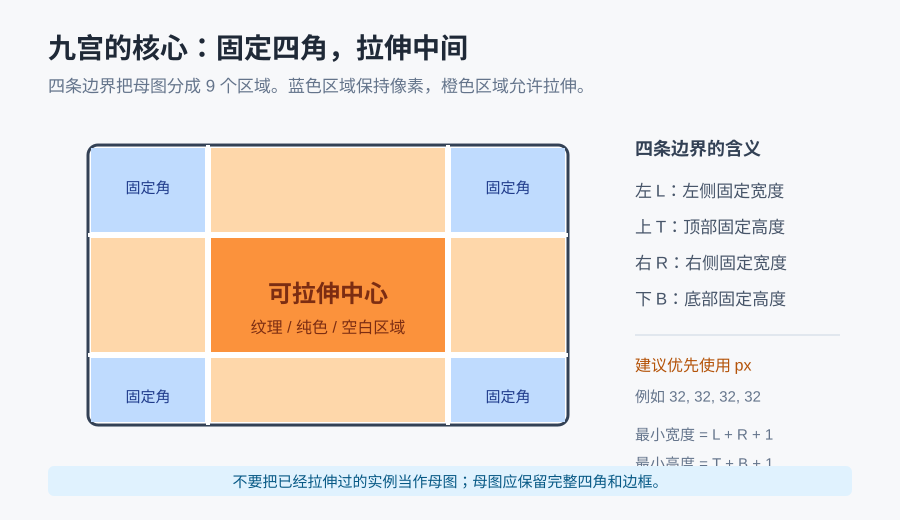
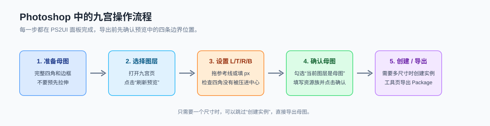
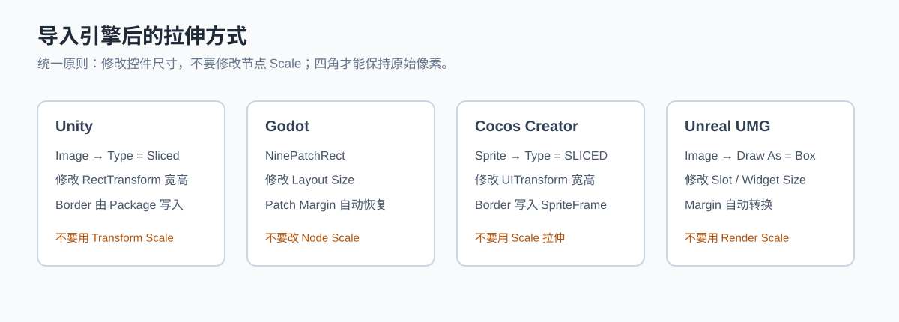

# PS2UI 产品中心

PS2UI 是一套面向游戏 UI 的跨引擎工具链：在 Photoshop 中完成设计和九宫标记，再把同一份 Package 导入 Unity、Godot、Cocos Creator 或 Unreal Engine。这个仓库提供 Photoshop 安装包、产品索引和教程；整合安装器与各引擎适配器使用独立 Release，避免混放无关文件。

在线产品中心：[PS2UI Studio](https://homer79980.github.io/)

## 快速开始

1. 安装 Photoshop 端 [PS2UI](https://github.com/Homer79980/PS2UI/releases/latest) 插件。
2. 在 Photoshop 中打开 PSD/PSB，设置九宫后导出 Package。
3. 选择目标引擎的安装包，安装到对应项目。
4. 从引擎插件菜单选择“导入 PS2UI 导出包”，选择包含 `layout.json` 和 `sprites` 的 Package 根目录。
5. 打开生成的场景、Prefab 或 Widget，按引擎文档调整尺寸。九宫只修改控件尺寸，不要用 Scale 拉伸。

## 当前版本

| 产品 | 版本 | 支持环境 | 下载 |
|---|---:|---|---|
| PS2UI Photoshop 导出器 | 2.1.4 | Photoshop 2023+ | [Release](https://github.com/Homer79980/PS2UI/releases/latest) |
| Ps2Unity | 2.1.1 | Unity 2022.3 | [Release](https://github.com/Homer79980/Ps2Unity-Releases/releases/latest) |
| Ps2Godot | 0.1.1 | Godot 4.6.2 | [Release](https://github.com/Homer79980/Ps2Godot-Releases/releases/latest) |
| Ps2Cocos | 0.1.1 | Cocos Creator 3.8.5-3.8.8 | [Release](https://github.com/Homer79980/Ps2Cocos-Releases/releases/latest) |
| Ps2Unreal | 0.1.1 | Unreal Engine 5.7/5.8 Win64 | [Release](https://github.com/Homer79980/Ps2Unreal-Releases/releases/latest) |
| PS2UI Engine Installer | 0.1.1 | Windows 10/11 x64 | [Release](https://github.com/Homer79980/PS2UI-Installer-Releases/releases/latest) |

> Windows 用户可直接使用 Engine Installer；Photoshop、手动安装和非 Windows 场景请进入对应产品的独立 Release。

## 安装方式

### 推荐：Engine Installer（Windows）

从 [Engine Installer Releases](https://github.com/Homer79980/PS2UI-Installer-Releases/releases/latest) 下载 `PS2UI-Engine-Installer-0.1.1.exe`，双击运行。安装器支持 Unity、Godot、Cocos Creator 和 Unreal Engine 多选，能够自动识别项目，也允许手动选择项目目录。安装前请关闭对应编辑器；安装器会备份旧插件、校验目标目录并在失败时回滚。

安装完成后，安装器会按所选引擎显示启用和首次导入步骤。安装器只安装项目级插件，不修改项目业务资源，也不会联网上传项目路径。

### Photoshop 插件

1. 下载 `PS2UI-Photoshop-2.1.4.ccx`。
2. 双击并在 Creative Cloud 确认安装。
3. 重启 Photoshop，从“插件 -> PS2UI”打开面板。
4. 面板左上角应显示 `v2.1.4`。

Photoshop 端支持 Windows/macOS 上的 Photoshop 2023（24.0）及以上版本。Photoshop 2022 及更早版本暂不支持当前 UXP 面板。

### 手动安装

如果不使用安装器，可从上方对应引擎的独立 Release 下载安装包，分别放到：

```text
Unity：项目/Packages/com.psd2unity.uiimport
Godot：项目/addons/ps2godot
Cocos：项目/extensions/ps2cocos
Unreal：项目/Plugins/Ps2Unreal
```

手动安装后重新打开编辑器，并在插件管理器中启用插件。Unreal 必须选择与 UE 小版本匹配的 Win64 包。

## 导入和九宫教程

完整的 Photoshop 九宫设置、Package 导出、资源复用、字体映射和四个引擎的拉伸方式见下方教程。第一次使用时，建议先完成“准备母图 -> 设置 L/T/R/B -> 导出 Package -> 引擎导入 -> 修改控件尺寸”的完整流程。

## 正式安装

1. 安装或更新 Adobe Creative Cloud Desktop。
2. 下载并双击 `PS2UI-Photoshop-2.1.4.ccx`。
3. 在 Creative Cloud 的安装确认窗口中完成安装。
4. 完全退出并重新启动 Photoshop。
5. 从 `插件 -> PS2UI` 打开面板，左上角应显示 `v2.1.4`。

当前正式包支持 Windows/macOS 上的 Photoshop 2023（24.0）及以上版本；Photoshop 2022 及更早版本不能加载这份 UXP 面板。

旧版 PS2Unity Photoshop 插件可以直接覆盖安装。内部插件 ID 仍为 `com.psd2unity.panel`，不会同时出现两个面板，旧 PSD 元数据和 Package Schema 继续兼容。

## 九宫完整教程

九宫的目标是：**四个角不变形，四条边只沿对应方向拉伸，中心区域负责填充**。PS2UI 的九宫数据会写入 Package，Unity、Godot、Cocos Creator 和 Unreal 导入器再把它转换成各自引擎的九宫组件。



### 先理解三个对象

- **母图**：设计师制作的原始完整图片，必须保留四角和边框的完整像素。母图不是已经拉伸过的截图。
- **边界 L/T/R/B**：从母图四条边向内量的固定区域，单位可以是 `px` 或 `%`。建议使用 `px`，更容易和 Photoshop、Unity、Godot、Cocos 以及 UMG 对照。
- **实例**：按照母图和边界生成的某个目标尺寸。实例只保存像素结果和母图关系，导出时可以和母图共享资源。

### 第 1 步：准备母图

1. 在 Photoshop 中打开 PSD/PSB。
2. 找到要做九宫的底板、按钮、面板或对话框图层。
3. 确认图层本身包含完整四角和边框，四周透明区域可以存在，但不要把有效像素放在画布外。
4. 不要先把母图拉成某个运行时尺寸，也不要使用已经变形的实例作为母图。
5. 如果中心区域有文字、图标或不可重复的装饰，先把它移到独立图层；九宫中心会被拉伸或重复，复杂内容不适合放在中心。

### 第 2 步：打开九宫面板并加载图层

1. 从 `插件 -> PS2UI` 打开面板，进入 `九宫` 页。
2. 在 Photoshop 图层面板中选中母图。
3. 面板顶部应显示图层名称和尺寸；如果仍显示“未选中图层”，重新点击图层或点击右上角刷新按钮。
4. 点击预览区域的 `刷新预览`。预览中的四条可拖动线就是 L/T/R/B 边界。
5. 也可以点击 `PS参考线`，插件会清除旧参考线，并按照当前 L/T/R/B 数值自动放置四条 Photoshop 参考线。

### 第 3 步：设置四条固定边

在面板的 `设置` 区域填写：

| 字段 | 固定内容 | 常见例子 |
|---|---|---:|
| 左 L | 左边固定宽度 | 32 px |
| 上 T | 顶部固定高度 | 32 px |
| 右 R | 右边固定宽度 | 32 px |
| 下 B | 底部固定高度 | 32 px |

操作建议：

1. 默认勾选 `等比例` 时，输入一个值可以同步四边，适合四边对称的面板。
2. 四边不相同时取消 `等比例`，分别填写 L/T/R/B。
3. 优先填写右侧的 `px` 输入框；百分比适合多个分辨率相近、但母图尺寸经常变化的设计。
4. 观察预览：边界内侧应包含完整四角和需要保留的边框；中心橙色区域应是允许拉伸的区域。
5. 边界必须满足：`L + R < 母图宽度`，`T + B < 母图高度`。实例的最小尺寸为 `L + R + 1` 乘 `T + B + 1`。
6. 只有横向拉伸时，把 `T` 和 `B` 设为 `0`；只有纵向拉伸时，把 `L` 和 `R` 设为 `0`。

### 第 4 步：确认母图和资源族

如果这个资源需要生成多个尺寸，建议使用资源族：

1. 在 `九宫资源族` 中填写稳定 ID，例如 `dialog_panel_blue` 或 `button_green`。只使用字母、数字、下划线和短横线，不要用显示名称或临时尺寸作为 ID。
2. 勾选 `当前图层是母图`。
3. 点击底部的 `确认`。
4. 看到状态提示成功后，再进行实例创建或导出。

母图确认后，资源族中的实例会共享边距、母图像素和样式。母图的填充、描边、圆角和图层样式应只在母图上修改；实例上的样式改动会在刷新时被母图恢复。

### 第 5 步：创建不同尺寸的实例

只需要一个尺寸时，可以跳过实例创建，直接导出母图。需要多个尺寸时，推荐这样操作：

1. 复制母图，得到一个临时目标尺寸图层。
2. 用 Photoshop 的自由变换把临时图层调整到目标宽高。只改变宽高和位置，不要旋转、透视或斜切。
3. 选中这个目标尺寸图层，确保面板中的资源族 ID 与母图一致。
4. 点击 `创建实例`。插件会读取当前选中图层的宽高，从母图重建一个九宫位图实例。
5. 确认新生成的实例四角、边框和中心效果正确后，可以删除用于提供尺寸的临时副本。
6. 后续直接变换 PS2UI 生成的实例并提交变换，插件会按母图自动刷新；需要手动重建时选中实例并点击 `刷新当前`。



注意：不要把实例再设置成新的母图，也不要手动改实例的 L/T/R/B。要改边界或外观，回到母图修改并确认，资源族会统一同步。

### 第 6 步：导出 Package

1. 进入 `工具` 页。
2. 可先点击 `导出前检查 Preflight`，确认九宫资源族、边界和实例关系没有错误。
3. 设置模块名，点击 `导出 Package` 并选择输出目录。
4. 导出的 Package 根目录必须包含 `layout.json`、`manifest.json` 和 `sprites/`。
5. 引擎导入时选择这个根目录，不要选择 `sprites` 子目录。

导出器会删除外围透明像素，但不会删除图层原本存在的非透明像素。相同解码像素且九宫契约兼容的母图和实例会尽量复用同一份物理 PNG；看到多个节点引用一张图片是正常的。

### 第 7 步：在引擎中拉伸

导入后，统一修改控件的尺寸，不要修改节点的 `Scale`。使用 Scale 会把四角一起放大，九宫效果就会失效。



| 引擎 | 正确组件 | 修改什么 |
|---|---|---|
| Unity | `Image`，`Type = Sliced` | `RectTransform` 宽高 |
| Godot | `NinePatchRect` | `Layout Size` |
| Cocos Creator | `Sprite`，`Type = SLICED` | `UITransform` 宽高 |
| Unreal | `Image`，`Draw As = Box` | Widget/Slot 尺寸 |

### 九宫验收清单

- 放大宽度时，左上、右上、左下、右下四角大小不变。
- 只放大高度时，左右边框宽度不变。
- 中心区域可以正常填充，没有把文字或图标拉成长条。
- 缩小到最小尺寸时，不低于 `L + R + 1` 和 `T + B + 1`。
- Photoshop、Package 和引擎中的边界数值一致。
- 同一资源族的多个实例使用同一母图和同一组边界。
- 重新导入同一个 Package 不会生成无意义的 `_1.png`、`_2.png`。

### 常见问题

**四角也被拉伸了**

通常是引擎中修改了 `Scale`，或九宫组件没有启用 Sliced/Box。先恢复 Scale 为 `1,1,1`，再修改控件尺寸。

**边框被切掉或缺半个角**

母图的 L/T/R/B 过大、母图本身已经被裁切，或者边界线压到了有效像素内部。回到 PS2UI 预览，重新检查四角是否完整，再确认并重新导出。

**中间纹理变形严重**

这通常不是导出失败，而是纹理、文字或装饰被放进了可拉伸中心。把不可拉伸内容拆到独立图层，或缩小中心区域并重新设置边界。

**实例没有跟着母图更新**

确认实例和母图的资源族 ID 完全一致；选中母图重新点击 `确认`，再选择实例点击 `刷新当前`。完成后重新导出，不要继续使用旧 Package。

**引擎中看起来还是旧图**

请导出到新的目录，或删除旧 Package 后重新导入。引擎端可能保留旧的 PNG、SpriteFrame、Texture2D 或 `.uasset`，仅覆盖 JSON 不一定会刷新旧资源。

## 普通图层和完整导出

1. 在 Photoshop 中打开 PSD/PSB。
2. 普通可见且有像素的图层可以直接导出，不要求固定命名前缀；隐藏层、空层以及明确以 `#` 或 `Ignore_` 标记的辅助层会跳过。
3. 需要九宫时按上面的教程先确认母图和实例，再导出。
4. 在工具页设置模块名；智能命名是可选步骤，不影响普通图层导出。
5. 点击 `导出 Package` 并选择输出位置。
6. 成功的 Package 根目录至少包含 `layout.json`、`manifest.json` 和 `sprites/`。
7. 在引擎插件中选择 Package 根目录，不要选择 `sprites` 子目录。

## AI 命名

- 每个图层只读取一次视觉摘要，预览保持原始宽高比，并将最长边归一到 256px。
- 箭头、锁、关闭等小图标使用独立视觉请求；大图最多 4 张一批，并发上限为 4。
- 粗略轮廓只用于候选分析，不再让未识别图层继承其它图片的语义名称。
- 模型、视觉内容、图层角色和项目上下文都未变化时，高置信度结果会命中本地缓存；缓存不包含 API Key，也不会随安装包发布。
- 需要绕过旧结果时点击“重新识别”，插件会忽略缓存并用本次结果覆盖对应条目。
- AI 结果仍会先显示在命名列表中，确认无误后再写回 Photoshop 图层。

## 字体说明

Package 已携带当前界面使用的字体身份、字号、行高、字距、对齐和文字矩形。日常导入引擎时不需要先额外导入字体 JSON。引擎端没有对应字体时仍会生成完整 UI，并在单一导入流程中提示绑定项目字体或暂用默认字体。

高级字体目录只用于跨项目共享稳定字体身份和样式，不包含字体文件，也不是导入前置条件。

## 更新提示

PS2UI 启动后会只读查询本仓库的 Latest Release。线上版本高于本地版本时，“设置”页签和“检查更新”按钮显示红点；插件不会静默下载或执行安装包。网络不可用时不会误报更新。

## 升级与卸载

- 升级：直接安装新版 CCX 后重启 Photoshop。
- 卸载：在 Creative Cloud Desktop 的插件管理中卸载 PS2UI。

## 引擎插件

| 引擎 | 安装入口 | 首次使用 |
|---|---|---|
| Unity | [Ps2Unity Release](https://github.com/Homer79980/Ps2Unity-Releases/releases/latest) | `Window -> Package Manager` 确认 Ps2Unity，然后导入 Package |
| Godot | [Ps2Godot Release](https://github.com/Homer79980/Ps2Godot-Releases/releases/latest) | `Project -> Project Settings -> Plugins` 启用 Ps2Godot |
| Cocos Creator | [Ps2Cocos Release](https://github.com/Homer79980/Ps2Cocos-Releases/releases/latest) | `Extension -> Extension Manager` 启用 Ps2Cocos |
| Unreal Engine | [Ps2Unreal Release](https://github.com/Homer79980/Ps2Unreal-Releases/releases/latest) | `Edit -> Plugins` 启用 Ps2Unreal，重启编辑器 |

## 字体和资源复用

导出 Package 时会携带当前文字的字体身份、字号、行距、字距和文本矩形。引擎导入时会优先匹配项目已有字体；没有字体 JSON 或没有绑定字体时，仍会生成完整 UI，并使用默认字体，不会丢失位置和尺寸参数。

项目中已有与 Package 像素完全相同的图片时，引擎会优先复用已有资源。不同尺寸、镜像或九宫边界不兼容的资源不会静默替换；需要人工确认时，插件会给出提示。

## 故障排查

- 菜单找不到：关闭编辑器，确认插件目录没有多嵌套一层，再重新打开项目。
- 导入没有反应：选择 Package 根目录，不要选择 `sprites` 子目录；大型项目首次导入可能需要扫描资源。
- 九宫变形：检查边界 L/T/R/B 和引擎组件类型，修改宽高，不要修改 Scale。
- 字体不一致：在引擎插件的字体管理入口绑定项目字体后重新导入；默认字体只能保证结构参数，不保证字形宽度完全相同。
- 安装器提示已安装：先关闭对应编辑器，再选择“修复”；安装器不会覆盖项目自定义的旧版插件。

## Package 兼容性

Package Schema 当前为 3，四个引擎适配器兼容读取 1、2、3。

## 校验下载

```powershell
Get-FileHash .\PS2UI-Photoshop-2.1.4.ccx -Algorithm SHA256
```

输出应与 `PS2UI-2.1.4-SHA256.txt` 一致。
